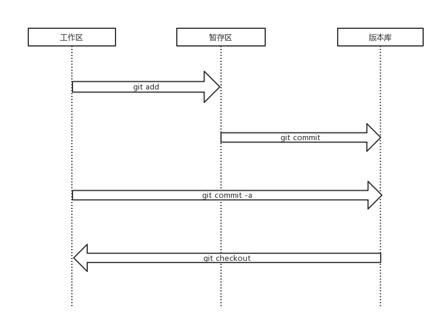

> **主要内容** : 对文件版本进行暂存,提交,管理,修改

首先了解这样几个概念 : 工作区 暂存区 版本库

工作区 : 对文件进行修改的区域,工作区的文件即当前看到的文件(可能是最新的,也可能是签出的某个版本的,或者是修改过的)
暂存区 : 对文件的修改可以暂存(git add)起来,但是不会提交到版本库
版本库 : 可以将暂存区的暂存修改提交到版本库成为一次提交,或者可以直接将工作区的文件的修改提交到版本库

同时,可以将版本库中特定版本(包括最新或者任意历史版本)的文件签出(git checkout)到工作区,已进行查看.

状态变化情况如图:




# 暂存

在仓库中添加一个文件 README.md ,使用 `git add` 将文件添加暂存开始跟踪该文件的修改

```
$ touch README.md # 创建文件
$ git add README.md #或者使用 git add . 添加目录当前所有文件
```

这样就把README.md 暂存添加到版本库并开始跟踪其修改

# 提交 

在 `git add` 前提下,使用 `git commit` 提交修改,将修改提交到版本库

```
λ git commit -m "add README.md"
[master (root-commit) a1cbcfa] add README.md
 1 file changed, 0 insertions(+), 0 deletions(-)
 create mode 100644 README.md
```

> 可以直接使用使用 git commit -a 暂存并提交修改(相当于git add . & git commit

**重点** : 每个提交都会有一个SHA-1校验和,用来表示这个唯一提交

# 状态查看

使用命令 `git status` 查看当前仓库的状态

```                                                 
$ touch README.md                                                            
                                                                             
$ git status                                                                 
On branch master                                                             
                                                                             
Initial commit                                                               
                                                                             
Untracked files:                                                             
  (use "git add <file>..." to include in what will be committed)             
                                                                             
        README.md                                                            
                                                                             
nothing added to commit but untracked files present (use "git add" to track) 
                                                                             
$ git add README.md                                                          
                                                                             
$ git status                                                                 
On branch master                                                             
                                                                             
Initial commit                                                               
                                                                             
Changes to be committed:                                                     
  (use "git rm --cached <file>..." to unstage)                               
                                                                             
        new file:   README.md                                                
                                                                               
$ git commit -m "add README.md"                                              
[master (root-commit) a1cbcfa] add README.md                                 
 1 file changed, 0 insertions(+), 0 deletions(-)                             
 create mode 100644 README.md                                                    
```

输出信息过多时,可以用 git status -s 查看简略信息

```
$ git status -s
 M README.md
?? CHANGELOG.md
```

# 历史查看

可以通过 `git log` 查看历史提交.

```
$ git log # 不用任何参数 会按提交时间列出所有的提交,最近的提交排在最上面

$ git log -2 # 输出最近2个提交

$ git log -p # 显示每次提交的内容差异

$ git log --stat # 每次提交的简略的统计信息

$ git log --pretty # 格式化输出
```

# 比较

比较两次提交可以使用 `git diff` 命令

```
$ git diff <file> # working tree 和 index 特定文件的差别
$ git diff --cached <file> # index 与 commit
$ git diff --staged <file> # working tree 与 commit
$ git diff <commit1> <commit2>
```

> diff 还可以比较分支,[分支](../1.4.分支/README.md)章节会再介绍

# 签出

使用 `git checkout` 从版本库签出特定版本到工作区

```
# git checkout <commit> -- <file> commit 指的是 某个提交的SHA-1值 可以不用完整的,一般取前六位就可以了
$ git checkout ab2314c -- README.md # 签出
```

> checkout 还可以签出分支,[分支](../1.4.分支/README.md)章节会再介绍

# 修改提交

## revert

`git revert` : 生成一个新的提交来撤销某次提交 此次提交之前的commit都会被保留

```
$ git revert <commit> # 完成后查看 commit ab2314c 依旧存在 并且有了一个新的提交撤销 ab2314c 这个提交

$ git log
commit f362392238e980369f60ab7a45e7e70f07ded7d8
Author: guodp <guodp9u0@gmail.com>
Date:   Tue Aug 1 16:37:29 2017 +0800

    Revert "add README.md"

    This reverts commit a1cbcfaf14455bece14f8ea83ea37b126fa0e15c.

commit a1cbcfaf14455bece14f8ea83ea37b126fa0e15c
Author: guodp <guodp9u0@gmail.com>
Date:   Tue Aug 1 15:38:14 2017 +0800

    add README.md
```

## reset

用 `git reset` 来回退到某个指定的提交(commit):

```
# git reset <commit> 
git reset --mixed <commit> : 默认 回退 commit 和 index 保留 working tree 
git reset --soft  <commit> : 回退到某个版本 只回退 commit 保留 index 和 working tree
git reset --hard  <commit> : 彻底回退到某个版本 同时也会 index 和 working tree 都会被修改
```

> 其本质是将HEAD指针指向 指定的commit,commit 信息不会被删除,可以根据commit 的SHA-1值 再次reset回来

## commit --amend

通过 `git commit --amend` 修改上次提交:(**这个会修改上次提交的SHA-1值**,因此实际上是一个新的提交)
* 如果当前没有新的修改,可以修改上次提交的messsage
* 如果当前有新的修改,可以修改上次提交的message,同时将修改跟上次提交一起作为同一个提交