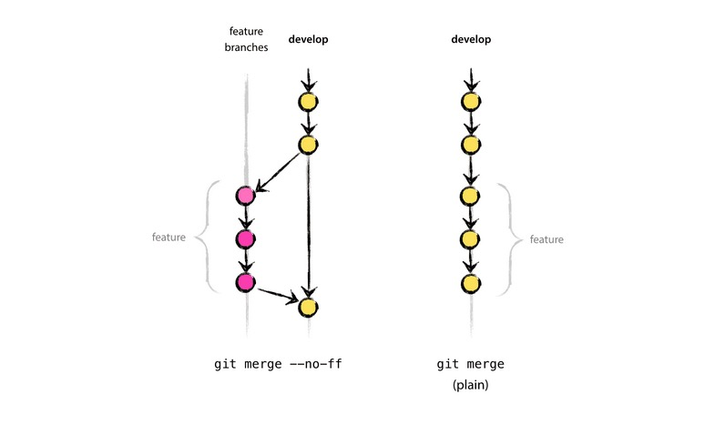

> **主要内容** : 分支管理

分支的作用是**代码隔离**,当多个功能开发并行时,如果都在同一个代码副本上进行,如果都在签入代码,势必需要等到所有功能都开发完成可以发布,例如,功能1完成并提交了50%, 功能2完成了100%, 需要等到功能1完成才可以发布,同时,功能1完成前,想要开发功能3...那就有很多问题了.

因此,可以通过分支进行代码隔离,保证并行的内容互相不影响.

Git 的分支管理非常方便,分支创建工作可以在很短时间内完成,因此鼓励合理的使用分支,提升项目管理效率.

# 新建

通过命令 `git branch <new-branch-name> <old-branch-name>` 创建分支,其中 old-branch-name 可以为空 默认为当前分支

```
$ git branch dev master # 从master 创建新分支
```

# 查看

```
$ git branch # 查看所有分支(本地)
  dev
  dev2
  dev3
* dev4 # 当前分支会打上 *
  master

$ git branch -a # 查看所有分支(本地和远程)
  dev
  dev2
  dev3
* dev4 # 当前分支会打上 *
  master
  remotes/origin/master
```

# 切换

使用命令 `git checkout <branch-name>` 切换分支

> `git checkout -b <new-branch-name> <old-branch-name>` 命令是创建并切换到新分支,其中 old-branch-name 可以为空 默认为当前分支,相当于

```
$ git branch <new-branch-name> <old-branch-name>
$ git checkout <new-branch-name>
```

# 删除

使用 `git branch -d <branch-name>` 删除已有分支,如果分支上还有未提交更改,需要加 `-f` 参数

# 合并

合并分支命令为 `git merge <from-branch-name>`

该命令会将 from-branch-name 分支上的提交合并到当前分支

merge 命令有两个参数 (Fast Forward) --no-ff --ff(default).区别是 --no-ff 会在合并后添加一个新的提交, --ff 则不会.如果图



# 远程分支

远程分支是指远程服务器上的分支,同样也是分支.本地仓库可以指定一个或者多个(当然也可不指定)远程服务器(remote),可以从远程服务器拉取远程分支上的修改,也可以将本地服务器的修改推送到远程服务器的分支上.

## fetch

通过fetch 命令,可以更新远程跟踪分支 : `git fetch <remote-name> <remote-branch-name>`

## pull

从远程分支拉去代码的命令为 : ` git pull <remote-name> <remote-branch-name>:<local-branch-name> `

pull 的过程其实是 fetch & merge,即下面两个操作是等效的

```
$ git pull origin next:next
# 相当于 
$ git fetch origin
$ git merge origin/next
```

## push

将本地分支推送到远程分支,使用命令 `git push <remote-name> <local-branch-name>:<remote-branch-name> `

> 可以使用 git push origin :<to-delete> 删除远程分支

pull(fetch) push 都会有 up-stream ,可以在 `git push` 时候 通过参数 `--set-upstream` 指定默认远程服务器

## 管理远程服务器

命令 `git remote` 用于管理远程命令 

```
$ git remote # 查看所有远程服务器

$ git remote show origin # 查看特定的远程服务器
* remote origin
  Fetch URL: git@github.com:dp9u0/Git-Test.git
  Push  URL: git@github.com:dp9u0/Git-Test.git
  HEAD branch: master
  Remote branch:
    master tracked
  Local branch configured for 'git pull':
    master merges with remote master
  Local ref configured for 'git push':
    master pushes to master (fast-forwardable)

$ git remote add # 添加远程服务器
```
