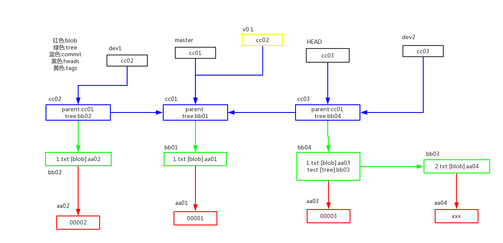

# Git 原理

Git 是一个内容寻址文件系统.可以理解为寻找的内容是对象,寻找方式是通过对commit,文件等的引用进行的.

## Git 对象

Git主要有一下几种对象:

### 对象

> 对象用一个40位的 SHA-1 值表示

* blob对象      :   数据,可以简单理解为文件内容,不包括文件名,表示某个状态下的文件内容
* tree对象      :   表示某个状态下的文件结构,内容有:指向blob对象(文件),或者tree对象(子目录),仓库都会有个根tree对象
* commit对象    :   表示一次提交commit,内容有:存放一个根tree引用,一个parent commit引用,以及提交信息(author & commit message)

### 命令

首先介绍这几个命令 :

计算一个数据的hash(SHA)值 : `git hash-object <file>|--stdin` 如果加上 `-w` 参数,会将计算的值写入仓库.

查看git对象类型 : `git cat-file -t <sha-1>`

查看git对象内容 : `git cat-file -p <sha-1>`

### Git 仓库目录

git 仓库中根目录下有个 .git 目录,所有仓库的对象,引用,配置等信息都定义在这个目录下.主要的有以下几个

* HEAD          :   当前分支(引用)
* index         :   文件保存暂存区信息
* objects/      :   存放Git对象,每个对象都有一个40位SHA值作为引用,前两位作为文件夹名,剩余38位作为文件名,文件中存储二进制内容,即对象的内容.
* refs/         :   Git引用,有三个目录:tag,heads(branch head),remotes(remote branch head)

> 当然还有 description,config,hooks/等文件或目录,这些不做介绍

#### 用具体例子来介绍这些内容

```
# git hash-object 计算hash值
$ echo 'test content' | git hash-object --stdin # 从stdin读取计算hash值
4894e536120417b9897821d3301120c4114ad522

$ echo 'test content' | git hash-object -w --stdin # 从stdin读取计算hash值 **并保存**
4894e536120417b9897821d3301120c4114ad522

$ echo 'test content' >> test.txt

$ git hash-object test.txt
725509f5430a0d09e46babade0c3dfc90271a354

$ git hash-object -w test.txt
725509f5430a0d09e46babade0c3dfc90271a354
# 查看目录结构
.git\objects
├── 72
|  └── 5509f5430a0d09e46babade0c3dfc90271a354
├── info
└── pack

$ git cat-file -t 725509
blob

$ git cat-file -p 725509
'test content'
                                                                      
$ git add .                                                           
                                                                      
$ git commit -m "first commit"                                        
[master (root-commit) 003358f] first commit                           
 1 file changed, 2 insertions(+)                                      
 create mode 100644 test.txt                                          
                                                                      
$ git log                                                             
commit 003358ffcad1d69d9ddbe8b30bc00658202c4049 (HEAD -> master)      
Author: guodp <guodp9u0@gmail.com>                                    
Date:   Wed Aug 2 15:36:40 2017 +0800                                
                                                                      
    first commit                                                      
                                                                      
$ git cat-file -t 003358                                              
commit                                                                
                                                                      
$ git cat-file -p 003358                                              
tree 14f52ee2aa7503f6795d686ac89e4352e75ccf54                         
author guodp <guodp9u0@gmail.com> 1501659400 +0800                    
committer guodp <guodp9u0@gmail.com> 1501659400 +0800                 
                                                                      
first commit 

$ git cat-file -t 14f5 # 查看tree对象
tree

$ git cat-file -p 14f5 # 查看tree对象
100644 blob 725509f5430a0d09e46babade0c3dfc90271a354    test.txt

$ git cat-file -t 725509 #查看 blob对象
blob

$ git cat-file -p 725509 #查看 blob对象
'test content'

# 继续添加文件并提交

$ mkdir test

$ touch test/eeee.txt

$ git add .

$ git commit -m "second commit"
[master 6842282] second commit
 1 file changed, 0 insertions(+), 0 deletions(-)
 create mode 100644 test/eeee.txt

$ git log
commit 6842282a745e3ac9b8460e8d5c94af454033a7a5 (HEAD -> master)
Author: guodp <guodp9u0@gmail.com>
Date:   Wed Aug 2 15:41:07 2017 +0800

    second commit

commit 003358ffcad1d69d9ddbe8b30bc00658202c4049
Author: guodp <guodp9u0@gmail.com>
Date:   Wed Aug 2 15:36:40 2017 +0800

    first commit

$ git cat-file -p 684228
tree f7efdb4b3fbb193adcc380e3f09b327d896937d6
parent 003358ffcad1d69d9ddbe8b30bc00658202c4049
author guodp <guodp9u0@gmail.com> 1501659667 +0800
committer guodp <guodp9u0@gmail.com> 1501659667 +0800

second commit

$ git cat-file -p f7efdb
100644 blob 725509f5430a0d09e46babade0c3dfc90271a354    test.txt
040000 tree 58bfc7c203bcb971db01c881bab3d9c474a99fca    test
                                                    
```

## Git 引用

本质上,分支,当前分支,tag等都是指向的commit对象,主要的引用有以下几中:

* HEAD : 当前分支
* heads(branch) : 本地引用(分支)
* remotes(remote branch) : 远程引用
* tags : tag 引用

可以通过 命令 `git update-ref refs/heads/master <SHA-1>` 更新引用



## 包文件

关于包文件 可以查看[Pro Git](https://git-scm.com/book/zh/v2/Git-%E5%86%85%E9%83%A8%E5%8E%9F%E7%90%86-%E5%8C%85%E6%96%87%E4%BB%B6)相关章节 .

* 小文件 : 差异
* 大文件 : 完整&压缩
