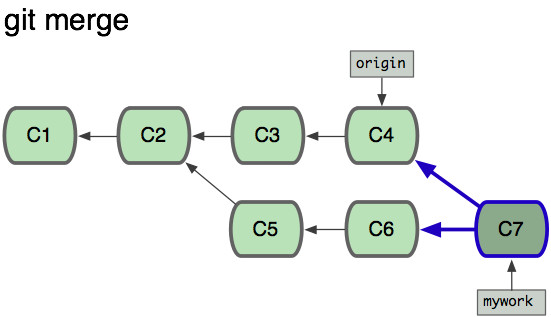
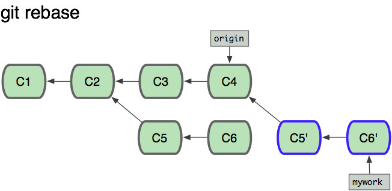

# stash

* `git stash` : 将当前修改存储起来,并清空 work tree 和 index 
* `git stash list` : 显示当前stash内容
* `git stash apply|pop --index <stash>` : 应用某个 stash 只需要指定编号即可,pop 是应用并弹出, apply 只应用 

# commit

* --amend

通过 `git commit --amend` 修改上次提交:(**这个会修改上次提交的SHA-1值**,因此实际上是一个新的提交)
* 如果当前没有新的修改,可以修改上次提交的messsage
* 如果当前有新的修改,可以修改上次提交的message,同时将修改跟上次提交一起作为同一个提交

# checkout

根据git原理章节,我们知道,分支,tag等都是对Commit对象的引用,因此签出分支其实是签出该分支最新(指向)的commit

* -b : 签出并在此签出点创建新分支

* -- file : 签出特定的文件

# reset

用 `git reset` 来回退到某个指定的提交(commit):

```
# git reset <commit> 
git reset --mixed <commit> : 默认 回退 commit 和 index 保留 working tree 
git reset --soft  <commit> : 回退到某个版本 只回退 commit 保留 index 和 working tree
git reset --hard  <commit> : 彻底回退到某个版本 同时也会 index 和 working tree 都会被修改
```

* --hard : 默认 回退 commit 和 index 保留 working tree 

* --soft

* --mix

* --keep

# rebase

rebase 是个很实用的命令

## 如何使用

`git rebase <branch-name>`

* -i 交互式的,可以选择commit是pick还是合并到前一个提交

* 与merge区别

这篇[博客](http://blog.csdn.net/hudashi/article/details/7664631/)讲的很详细:





# cherry-pick

相当于在当前分支上 rebase 另一个分支的单个提交